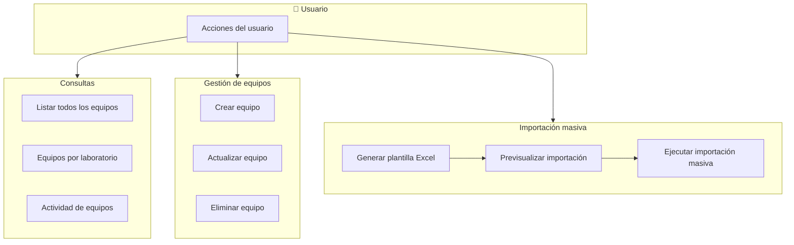

# Flujo del módulo Equipos

## Mapa de procesos de negocio

---

## Flujo paso a paso

---

## 1. Listar todos los equipos (con filtros)

1. **Frontend – equipoService.getAll**  
   Construye query params (tipo_equipo_id, estado, laboratorio_id) y llama GET `/equipos` o `/equipos?…`.

2. **Backend – equipoRoutes**  
   Ruta GET `/`. Middlewares: authenticateToken, authorize('read', 'Equipo'), validate(getEquiposSchema).

3. **Backend – equipoController.getEquipos**  
   Lee query, arma filters y llama equipoService.getEquipos(rol, laboratorio_ids, filters).

4. **Backend – equipoService.getEquipos**  
   Delega en Equipo.getAll(rol, laboratorio_ids, filters).

5. **Backend – Equipo.getAll**  
   Consulta equipos aplicando rol y laboratorios del usuario y filtros. Devuelve lista.

6. **Backend – equipoController.getEquipos**  
   Responde 200 con `{ success, data: equipos, total_equipos }`.

---

## 2. Obtener equipos por laboratorio

1. **Frontend – equipoService.getByLaboratorio**  
   Llama GET `/equipos/:laboratorio_id` con query opcional (tipo_equipo_id, estado).

2. **Backend – equipoRoutes**  
   Ruta GET `/:laboratorio_id`. Middlewares: authenticateToken, authorize('read', 'Equipo'), validate(getEquipoByLaboratorioSchema).

3. **Backend – equipoController.getEquipoByLaboratorio**  
   Toma laboratorio_id de params y query; arma filters y llama equipoService.getEquipoByLaboratorio(laboratorio_id, filters).

4. **Backend – equipoService.getEquipoByLaboratorio**  
   Delega en Equipo.getByLaboratorio(laboratorio_id, filters).

5. **Backend – Equipo.getByLaboratorio**  
   Consulta equipos del laboratorio con filtros. Devuelve lista.

6. **Backend – equipoController.getEquipoByLaboratorio**  
   Responde 200 con `{ success, data: equipos }`.

---

## 3. Crear equipo

1. **Frontend – equipoService.create**  
   Envía POST `/equipos` con body (codigo, nombre, descripcion, marca, modelo, numero_serie, estado, fechas mantenimiento, comentarios, condicion, fecha_adquisicion, tipo_equipo_id, laboratorio_id, inventario_inicial opcional).

2. **Backend – equipoRoutes**  
   Ruta POST `/`. Middlewares: authenticateToken, authorize('create', 'Equipo'), validate(createEquipoSchema).

3. **Backend – equipoController.createEquipo**  
   Extrae body y llama equipoService.crearEquipo(datos, inventario_inicial, userId, ip).

4. **Backend – equipoService.crearEquipo**  
   Equipo.existsByCodigo(codigo); si existe lanza AppError 400. Equipo.create(datos): inserta equipo y devuelve equipo_id. Equipo.registrarActividadEquipo(accion: 'crear', equipo_id, descripcion, usuario_id, ip_address). Devuelve equipo_id.

5. **Backend – equipoController.createEquipo**  
   Responde 201 con `{ success, message }`.

---

## 4. Actualizar equipo

1. **Frontend – equipoService.update**  
   Envía PUT `/equipos/:id` con body (campos editables del equipo).

2. **Backend – equipoRoutes**  
   Ruta PUT `/:id`. Middlewares: authenticateToken, authorize('update', 'Equipo'), validate(updateEquipoSchema).

3. **Backend – equipoController.updateEquipo**  
   Toma id de params y body; llama equipoService.actualizarEquipo(id, datos, userId, ip).

4. **Backend – equipoService.actualizarEquipo**  
   Equipo.existsById(equipoId); si no existe lanza 404. Equipo.existsByCodigo(codigo, equipoId); si otro equipo tiene el código lanza 400. Equipo.getById(equipoId). Equipo.reservasActivasByLaboratorioId(equipoId, laboratorio_actual); si tiene reservas y se cambia laboratorio_id lanza 400. Equipo.update(equipoId, datos). Equipo.registrarActividadEquipo(accion: 'actualizar', ...). Devuelve objeto con id y datos actualizados.

5. **Backend – equipoController.updateEquipo**  
   Responde 200 con `{ success, message, data }`.

---

## 5. Eliminar equipo

1. **Frontend – equipoService.delete**  
   Llama DELETE `/equipos/:id`.

2. **Backend – equipoRoutes**  
   Ruta DELETE `/:id`. Middlewares: authenticateToken, authorize('delete', 'Equipo'), validate(deleteEquipoSchema).

3. **Backend – equipoController.deleteEquipo**  
   Toma id de params y llama equipoService.eliminarEquipo(id, userId, ip).

4. **Backend – equipoService.eliminarEquipo**  
   Equipo.existsById(equipoId); si no existe lanza 404. Equipo.reservasActivas(equipoId); si tiene reservas activas lanza 400. Equipo.getById(equipoId) para datos. Equipo.delete(equipoId). Equipo.registrarActividadEquipo(accion: 'eliminar', ...).

5. **Backend – equipoController.deleteEquipo**  
   Responde 200 con `{ success, message }`.

---

## 6. Obtener actividad de equipos

1. **Frontend – equipoService.getActividad**  
   Llama GET `/equipos/actividad` con query (laboratorio_id, fecha_inicio, fecha_fin, tipo_movimiento).

2. **Backend – equipoRoutes**  
   Ruta GET `/actividad`. Middlewares: authenticateToken, authorize('read', 'Equipo'), validate(getActividadEquiposSchema).

3. **Backend – equipoController.getActividadEquipos**  
   Lee query y llama equipoService.getActividadEquipos(rol, laboratorio_ids, laboratorio_id, fecha_inicio, fecha_fin, tipo_actividad, usuario_id).

4. **Backend – equipoService.getActividadEquipos**  
   Delega en Equipo.getActividadEquipos con los mismos parámetros.

5. **Backend – Equipo.getActividadEquipos**  
   Consulta tabla de actividad de equipos aplicando rol, laboratorios y filtros. Devuelve lista.

6. **Backend – equipoController.getActividadEquipos**  
   Responde 200 con `{ success, data, total_registros, filtros_aplicados }`.

---

## 7. Generar plantilla Excel para importación masiva

1. **Frontend – equipoService.descargarPlantillaImportacion**  
   Llama GET `/equipos/plantilla-importacion` con responseType blob.

2. **Backend – equipoRoutes**  
   Ruta GET `/plantilla-importacion`. Middlewares: authenticateToken, authorize('create', 'Equipo').

3. **Backend – equipoController.generarPlantillaImportacionEquipos**  
   Llama equipoService.getDatosPlantillaEquipos() (tipos_equipo). Crea workbook XLSX: hoja "Plantilla Equipos" con columnas (CODIGO, NOMBRE, TIPO_EQUIPO_ID, DESCRIPCION, MARCA, MODELO, NUMERO_SERIE, ESTADO, FECHA_ULTIMO_MANTENIMIENTO, FECHA_PROXIMO_MANTENIMIENTO, COMENTARIOS, CONDICION, FECHA_ADQUISICION) — **sin LABORATORIO_CODIGO** — y filas de ejemplo; hoja "INSTRUCCIONES" con instrucciones y listado de tipos de equipo (sin listado de laboratorios: el laboratorio se elige en la UI al importar). Escribe buffer y envía con headers de descarga.

4. **Backend – equipoService.getDatosPlantillaEquipos**  
   TipoEquipo.getAll() (y laboratorios solo si se usan en otras partes). Devuelve { laboratorios, tipos_equipo }.

5. **Backend – equipoController.generarPlantillaImportacionEquipos**  
   Responde con archivo binario (plantilla_equipos_YYYY-MM-DD.xlsx).

---

## 8. Previsualizar importación masiva (Excel)

El usuario selecciona un **laboratorio** en la UI; todos los equipos del Excel se previsualizan/importan en ese laboratorio. El Excel **no** incluye la columna LABORATORIO_CODIGO.

1. **Frontend – equipoService.previsualizarImportacion**  
   Envía POST `/equipos/previsualizar-importacion` con FormData: `archivo_excel` (file) y `laboratorio_id` (número del laboratorio seleccionado).

2. **Backend – equipoRoutes**  
   Ruta POST `/previsualizar-importacion`. Middlewares: authenticateToken, authorize('create', 'Equipo'), heavyOperationLimiter, upload.single('archivo_excel'), validate(previsualizarImportacionEquiposSchema) — valida `laboratorio_id` en req.body.

3. **Backend – equipoController.previsualizarImportacionMasivaEquipos**  
   Verifica req.file y lee laboratorio_id de req.body. Lee Excel (XLSX.read buffer, sheet_to_json). Si vacío responde 400. Llama equipoService.previsualizarImportacion(data, laboratorio_id).

4. **Backend – equipoService.previsualizarImportacion**  
   Valida que laboratorio_id exista. Llama getDatosPlantillaEquipos (tipos_equipo). Ignora columna LABORATORIO_CODIGO si viene en el archivo. Por cada fila: extrae y normaliza campos (CODIGO, NOMBRE, tipo_equipo_id, fechas, estado, condicion, etc.), asigna laboratorio_id recibido a todas las filas, valida obligatorios y valores (estados, condiciones, tipo válido), arma errores por fila. Devuelve array de objetos { fila, codigo, nombre, ..., laboratorio_id, errores }.

5. **Backend – equipoController.previsualizarImportacionMasivaEquipos**  
   Responde 200 con `{ data: previewData, total_filas, errores_generales }`.

---

## 9. Ejecutar importación masiva de equipos

1. **Frontend – equipoService.importacionMasiva**  
   Envía POST `/equipos/importacion-masiva` con FormData: `archivo_excel` (file) y `laboratorio_id` (número del laboratorio seleccionado).

2. **Backend – equipoRoutes**  
   Ruta POST `/importacion-masiva`. Middlewares: authenticateToken, authorize('create', 'Equipo'), heavyOperationLimiter, upload.single('archivo_excel'), validate(importacionMasivaEquiposSchema) — valida `laboratorio_id` en req.body.

3. **Backend – equipoController.importacionMasivaEquipos**  
   Verifica req.file y lee laboratorio_id de req.body. Lee Excel y convierte a JSON. Si vacío responde 400. Llama equipoService.importacionMasiva(data, laboratorioId, userId, ip).

4. **Backend – equipoService.importacionMasiva**  
   Valida que laboratorioId exista. TipoEquipo.getAll(). Obtiene conexión e inicia transacción. Ignora columna LABORATORIO_CODIGO si viene en el archivo. Por cada fila: valida NOMBRE, CODIGO, TIPO_EQUIPO_ID, fechas, estado, condicion; asigna el laboratorio_id recibido a todos los equipos; Equipo.create(equipoData, connection); Equipo.registrarActividadEquipo(accion: 'crear', ...). Acumula procesados, resultados y errores. Si hay solo errores y ningún procesado hace rollback y lanza AppError con errores. Commit. Libera conexión. Devuelve { procesados, errores, resultados }.

5. **Backend – equipoController.importacionMasivaEquipos**  
   Responde 200 con `{ success, message, procesados, errores, detalles_errores, resultados }`.
