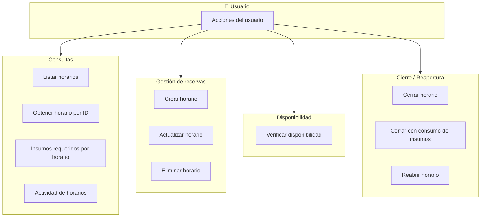

# Flujo del módulo Horario

## Mapa de procesos de negocio

---

## Flujo paso a paso

---

## 1. Listar horarios

1. **Frontend – horarioService.getAll**  
   Construye query params (laboratorio_id, escuela_id, docente_id, ciclo_id, fecha_inicio, fecha_fin, estado) y llama GET `/horarios`.

2. **Backend – horarioRoutes**  
   Ruta GET `/`. Middlewares: authenticateToken, authorize('read', 'Horario').

3. **Backend – horarioController.getHorarios**  
   Lee query, arma objeto filters y llama al servicio.

4. **Backend – horarioService.getHorarios**  
   Valida rango de fechas (máx. 60 días) y delega en modelo.

5. **Backend – Horario.getAllHorarios**  
   Consulta horarios aplicando rol y laboratorios del usuario y filtros. Devuelve lista.

6. **Backend – horarioController.getHorarios**  
   Responde 200 con `{ success, data: horarios }`.

---

## 2. Obtener un horario por ID (detalle)

1. **Frontend – horarioService.getById**  
   Llama GET `/horarios/:id`.

2. **Backend – horarioRoutes**  
   Ruta GET `/:id`. Middlewares: authenticateToken, authorize('read', 'Horario'), validate(getHorarioByIdSchema).

3. **Backend – horarioController.getHorario**  
   Toma `id` de params y llama al servicio.

4. **Backend – horarioService.getHorarioById**  
   Obtiene horario base, insumos requeridos, insumos consumidos y equipos; arma objeto completo.

5. **Backend – Horario.getHorarioById**  
   Consulta reserva por ID.

6. **Backend – Horario.getInsumosRequeridosByHorario**  
   Devuelve insumos asociados al horario.

7. **Backend – Horario.getInsumosConsumidosByHorario**  
   Devuelve insumos ya consumidos en ese horario.

8. **Backend – Horario.getEquiposRequeridosByHorario**  
   Devuelve equipos asociados al horario.

9. **Backend – horarioController.getHorario**  
   Responde 200 con `{ success, data: horarioConInsumos }`.

---

## 3. Obtener insumos requeridos por horario

1. **Frontend – horarioService.getInsumosRequeridosById**  
   Llama GET `/horarios/:id/insumos-requeridos`.

2. **Backend – horarioRoutes**  
   Ruta GET `/:id/insumos-requeridos`. Middlewares: authenticateToken, authorize('read', 'Horario'), validate(getInsumosRequeridosByIdSchema).

3. **Backend – horarioController.getInsumosRequeridosById**  
   Toma `id` de params y llama al servicio.

4. **Backend – horarioService.getInsumosRequeridosById**  
   Delega en modelo.

5. **Backend – Horario.getInsumosRequeridosById**  
   Consulta y devuelve lista de insumos requeridos.

6. **Backend – horarioController.getInsumosRequeridosById**  
   Responde 200 con `{ success, data: insumos }`.

---

## 4. Crear horario (reserva)

1. **Frontend – horarioService.create**  
   Envía POST `/horarios` con body (laboratorio_id, docente_id, escuela_id, ciclo_id, descripcion, fecha_inicio, fecha_fin, cantidad_alumnos, color, insumos, equipos).

2. **Backend – horarioRoutes**  
   Ruta POST `/`. Middlewares: authenticateToken, authorize('create', 'Horario'), validate(createHorarioSchema).

3. **Backend – horarioController.createHorario**  
   Extrae datos del body y llama horarioService.crearReserva con insumos, equipos, userId e IP.

4. **Backend – horarioService.crearReserva**  
   Valida escuela (Escuela.getById), ciclo (Ciclo.getById), docente (Docente.getById). Llama verificarCruceHorarios.

5. **Backend – verificarCruceHorarios**  
   Convierte fechas a MySQL. Horario.getCruceLab: comprueba conflicto por laboratorio. Si hay cruce devuelve objeto tipo 'laboratorio'. Horario.getCruceDocente: comprueba conflicto por docente. Si hay cruce devuelve objeto tipo 'docente'. Si hay conflicto, servicio lanza AppError 409.

6. **Backend – horarioService.crearReserva**  
   Inicia transacción. Horario.createHorario: inserta reserva y devuelve reserva_id. Si hay insumos: Horario.createHorarioInsumos. Si hay equipos: Horario.createHorarioEquipos. Commit. Laboratorio.getLaboratorioById para nombre. Horario.registrarActividadHorario (accion: 'crear'). Devuelve reserva_id e insumos/equipos procesados.

7. **Backend – horarioController.createHorario**  
   Responde 201 con `{ success, message, data: { reserva_id, insumos_procesados, equipos_procesados } }`.

---

## 5. Actualizar horario

1. **Frontend – horarioService.update**  
   Envía PUT `/horarios/:id` con body (mismos campos que crear).

2. **Backend – horarioRoutes**  
   Ruta PUT `/:id`. Middlewares: authenticateToken, authorize('update', 'Horario'), validate(updateHorarioSchema).

3. **Backend – horarioController.updateHorario**  
   Toma id de params y body, llama horarioService.actualizarReserva.

4. **Backend – horarioService.actualizarReserva**  
   Valida escuela, ciclo, docente. Llama verificarCruceHorarios pasando horarioId (excluir este horario). Horario.exitsById. Inicia transacción. Horario.deleteHorarioInsumos, Horario.deleteHorarioEquipos. Horario.updateHorario. Si hay insumos: Horario.createHorarioInsumos. Si hay equipos: Horario.createHorarioEquipos. Commit. Horario.registrarActividadHorario (accion: 'editar'). Devuelve datos de escuela, ciclo, docente e insumos/equipos nuevos.

5. **Backend – horarioController.updateHorario**  
   Responde 200 con `{ success, message, validaciones, insumos_nuevos, equipos_nuevos }`.

---

## 6. Eliminar horario

1. **Frontend – horarioService.delete**  
   Llama DELETE `/horarios/:id`.

2. **Backend – horarioRoutes**  
   Ruta DELETE `/:id`. Middlewares: authenticateToken, authorize('delete', 'Horario'), validate(deleteHorarioSchema).

3. **Backend – horarioController.deleteHorario**  
   Toma id de params y llama horarioService.eliminarReserva.

4. **Backend – horarioService.eliminarReserva**  
   Horario.exitsById. Horario.getHorarioById; si estado 'C' (cerrado) lanza AppError 409. Transacción: Horario.deleteHorarioInsumos, Horario.deleteHorarioEquipos, Horario.deleteHorario. Commit. Horario.registrarActividadHorario (accion: 'eliminar'). Devuelve id.

5. **Backend – horarioController.deleteHorario**  
   Responde 200 con `{ success, message, data: { id } }`.

---

## 7. Verificar disponibilidad (laboratorio/docente)

1. **Frontend – horarioService.verificarDisponibilidad**  
   Envía POST `/horarios/verificar-disponibilidad` con body (laboratorio_id, docente_id, fecha_inicio, fecha_fin, horario_id opcional).

2. **Backend – horarioRoutes**  
   Ruta POST `/verificar-disponibilidad`. Middlewares: authenticateToken, authorize('read', 'Horario'), validate(verificarDisponibilidadSchema).

3. **Backend – horarioController.verificarDisponibilidad**  
   Extrae body y llama horarioService.verificarDisponibilidad.

4. **Backend – horarioService.verificarDisponibilidad**  
   Llama verificarCruceHorarios. Si hay cruce devuelve `{ disponible: false, motivo, tipo_conflicto, conflicto_detalle }`. Si no, `{ disponible: true, mensaje }`.

5. **Backend – horarioController.verificarDisponibilidad**  
   Responde 200 con disponible true o false y datos asociados.

---

## 8. Cerrar horario (sin insumos)

1. **Frontend – horarioService.cerrarHorario**  
   Llama POST `/horarios/:id/cerrar`.

2. **Backend – horarioRoutes**  
   Ruta POST `/:id/cerrar`. Middlewares: authenticateToken, authorize('update', 'Horario').

3. **Backend – horarioController.cerrarHorario**  
   Toma id de params y llama horarioService.cerrarHorario.

4. **Backend – horarioService.cerrarHorario**  
   Horario.exitsById. Horario.estadoHorario; si ya cerrado lanza 409. Horario.getHorarioById. Transacción: Horario.cerrarHorario(reserva_id). Commit. Horario.registrarActividadHorario (accion: 'cerrar').

5. **Backend – horarioController.cerrarHorario**  
   Responde 200 con `{ success, message }`.

---

## 9. Cerrar horario con consumo de insumos

1. **Frontend – horarioService.cerrarHorarioConInsumos**  
   Envía POST `/horarios/cerrar-con-insumos` con body (laboratorio_id, tipo_movimiento, fecha_movimiento, observaciones, reserva_id, detalles).

2. **Backend – horarioRoutes**  
   Ruta POST `/cerrar-con-insumos`. Middlewares: authenticateToken, authorize('update', 'Horario'), validate(cerrarHorarioSchema).

3. **Backend – horarioController.cerrarHorarioConInsumos**  
   Extrae body y llama horarioService.cerrarHorarioConInsumos.

4. **Backend – horarioService.cerrarHorarioConInsumos**  
   Horario.exitsById. Horario.estadoHorario; si cerrado lanza 409. Horario.getHorarioById. Transacción: Horario.cerrarHorario(reserva_id). Inventario.registrarMovimiento (movimiento de inventario con detalles). Horario.marcarTieneConsumoInsumos(reserva_id, connection). Commit. Horario.registrarActividadHorario (accion: 'cerrar'). Devuelve movimiento_id.

5. **Backend – horarioController.cerrarHorarioConInsumos**  
   Responde 200 con `{ success, message, data: { movimiento_id } }`.

---

## 10. Reabrir horario

1. **Frontend – horarioService.reabrirHorario**  
   Llama PATCH `/horarios/:id/reabrir`.

2. **Backend – horarioRoutes**  
   Ruta PATCH `/:id/reabrir`. Middlewares: authenticateToken, authorize('update', 'Horario').

3. **Backend – horarioController.reabrirHorario**  
   Toma id de params y llama horarioService.reabrirHorario.

4. **Backend – horarioService.reabrirHorario**  
   Horario.exitsById. Horario.estadoHorario; si no está cerrado lanza 409. Horario.getMovimientoByReservaId. Horario.getHorarioById. Transacción: si hay movimiento, Inventario.eliminarMovimientoInventario y Horario.desmarcarTieneConsumoInsumos(reserva_id, connection). Horario.reabrirHorario(reserva_id). Commit. Horario.registrarActividadHorario (accion: 'reabrir'). Devuelve tiene_movimiento y movimiento_id.

5. **Backend – horarioController.reabrirHorario**  
   Responde 200 con `{ success, message, data }`.

---

## 11. Obtener actividad de horarios

1. **Frontend – horarioService.getActividad**  
   Llama GET `/horarios/actividad` con query (laboratorio_id, fecha_inicio, fecha_fin, accion, usuario_id).

2. **Backend – horarioRoutes**  
   Ruta GET `/actividad`. Middlewares: authenticateToken, authorize('read', 'Horario'), validate(getActividadHorariosSchema).

3. **Backend – horarioController.getActividadHorarios**  
   Lee query y llama horarioService.getActividadHorarios con rol y laboratorio_ids del usuario.

4. **Backend – horarioService.getActividadHorarios**  
   Horario.getActividadHorarios con filtros. Mapea filas convirtiendo fecha_actividad a ISO. Devuelve lista.

5. **Backend – horarioController.getActividadHorarios**  
   Responde 200 con `{ success, data, total }`.
