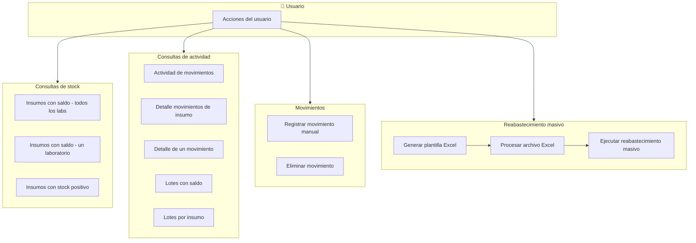

# Flujo del módulo Inventario

## Mapa de procesos de negocio

---

## Nomenclatura (modelo vs API)

- **Modelo** `Inventario.registrarMovimiento(connection, ...)`: método genérico para registrar un movimiento (entrada o salida); lo usan tanto el flujo de **movimiento manual** como el de **reabastecimiento masivo**. No inicia transacciones; recibe la conexión del service.
- **Movimiento manual (API)**: ruta POST `/movimiento-manual`; controller `registrarMovimientoManual`; service `inventarioService.registrarMovimientoManual`; esquema `registrarMovimientoManualSchema`.
- **Reabastecimiento masivo**: ruta POST `/reabastecimiento-masivo`; service `inventarioService.ejecutarReabastecimientoMasivo`; internamente llama a `Inventario.registrarMovimiento`.

---

## Flujo paso a paso

---

## 1. Obtener insumos con saldo de todos los laboratorios

1. **Frontend – inventarioService.getAllWithStock**  
   Llama GET `/inventario/all-con-saldo`.

2. **Backend – inventarioRoutes**  
   Ruta GET `/all-con-saldo`. Middlewares: authenticateToken, authorize('read', 'Inventario').

3. **Backend – inventarioController.getAllInsumosWithStock**  
   Llama Inventario.getAllInsumosConSaldo(rol, laboratorio_ids).

4. **Backend – Inventario.getAllInsumosConSaldo**  
   Consulta insumos y su stock según rol y laboratorios del usuario. Devuelve lista.

5. **Backend – inventarioController.getAllInsumosWithStock**  
   Responde 200 con `{ success, data: insumos }`.

---

## 2. Obtener insumos con saldo de un laboratorio

1. **Frontend – inventarioService.getWithStock**  
   Llama GET `/inventario/insumos-con-saldo?laboratorio_id=...`.

2. **Backend – inventarioRoutes**  
   Ruta GET `/insumos-con-saldo`. Middlewares: authenticateToken, authorize('read', 'Inventario'), validate(getInsumosWithStockSchema).

3. **Backend – inventarioController.getInsumosWithStock**  
   Toma laboratorio_id de query y llama Inventario.getInsumosConSaldo(laboratorio_id).

4. **Backend – Inventario.getInsumosConSaldo**  
   Consulta insumos y stock del laboratorio. Devuelve lista.

5. **Backend – inventarioController.getInsumosWithStock**  
   Responde 200 con `{ success, data: insumos }`.

---

## 3. Obtener insumos con stock positivo de un laboratorio

1. **Frontend – inventarioService.getWithPositiveStock**  
   Llama GET `/inventario/insumos-con-saldo-positivo?laboratorio_id=...`.

2. **Backend – inventarioRoutes**  
   Ruta GET `/insumos-con-saldo-positivo`. Middlewares: authenticateToken, authorize('read', 'Inventario'), validate(getInsumosWithPositiveStockSchema).

3. **Backend – inventarioController.getInsumosWithPositiveStock**  
   Toma laboratorio_id de query y llama Inventario.getInsumosConSaldoPositivo(laboratorio_id).

4. **Backend – Inventario.getInsumosConSaldoPositivo**  
   Consulta insumos del laboratorio con stock > 0. Devuelve lista.

5. **Backend – inventarioController.getInsumosWithPositiveStock**  
   Responde 200 con `{ success, data: insumos }`.

---

## 4. Obtener actividad de movimientos (listado con filtros)

1. **Frontend – inventarioService.getActividad**  
   Llama GET `/inventario/actividad` con query (laboratorio_id, fecha_inicio, fecha_fin, tipo_movimiento).

2. **Backend – inventarioRoutes**  
   Ruta GET `/actividad`. Middlewares: authenticateToken, authorize('read', 'Inventario'), validate(getActividadInsumosSchema).

3. **Backend – inventarioController.getActividadInsumos**  
   Lee query y llama Inventario.getActividadInsumos(rol, laboratorio_ids, laboratorio_id, fecha_inicio, fecha_fin, tipo_movimiento).

4. **Backend – Inventario.getActividadInsumos**  
   Consulta movimientos aplicando rol, laboratorios y filtros. Devuelve filas.

5. **Backend – inventarioController.getActividadInsumos**  
   Convierte fechas a ISO en cada fila. Responde 200 con `{ success, data, total_movimientos, filtros_aplicados }`.

---

## 5. Obtener detalle de movimientos de un insumo

Listado de todos los movimientos que afectan a **un insumo** (historial por insumo). Frontend: modal **DetalleMovimientosInsumoModal**; título en UI: "Detalle de movimientos de insumo".

1. **Frontend – inventarioService.getActividadDetalleInsumos**  
   Llama GET `/inventario/actividad-detalle?insumo_id=...&laboratorio_id=...` (laboratorio opcional).

2. **Backend – inventarioRoutes**  
   Ruta GET `/actividad-detalle`. Middlewares: authenticateToken, authorize('read', 'Inventario'), validate(getActividadDetalleInsumosSchema).

3. **Backend – inventarioController.getActividadDetalleInsumos**  
   Toma insumo_id y laboratorio_id de query y llama Inventario.getActividadDetalleInsumos(rol, laboratorio_ids, laboratorio_id, insumo_id).

4. **Backend – Inventario.getActividadDetalleInsumos**  
   Consulta detalle de movimientos del insumo con filtros. Devuelve lista.

5. **Backend – inventarioController.getActividadDetalleInsumos**  
   Responde 200 con `{ success, data: actividad }`.

---

## 5.5. Obtener detalle de un movimiento (cabecera y líneas de insumos)

Cabecera del movimiento (fecha, tipo, laboratorio, usuario, observaciones, reserva) y **líneas** (insumos movidos: insumo, cantidad, lote, unidad). Se usa desde la pantalla de actividad para ver qué insumos tiene un movimiento antes de deshacerlo. Frontend: modal **DetalleMovimientoModal**; título en UI: "Detalle de un movimiento". Paginación de la tabla de líneas solo en frontend.

1. **Frontend – inventarioService.getDetalleMovimiento**  
   Llama GET `/inventario/actividad/movimiento/:movimiento_id/detalle` (movimiento_id en el path).

2. **Backend – inventarioRoutes**  
   Ruta GET `/actividad/movimiento/:movimiento_id/detalle`. Middlewares: authenticateToken, authorize('read', 'Inventario'), validate(getDetalleMovimientoSchema).

3. **Backend – inventarioController.getDetalleMovimiento**  
   Toma movimiento_id de req.params y llama inventarioService.getDetalleMovimiento(movimiento_id, rol, laboratorio_ids).

4. **Backend – inventarioService.getDetalleMovimiento**  
   Llama Inventario.getDetalleMovimiento(movimiento_id, rol, laboratorio_ids). Si el modelo devuelve null (movimiento no existe o usuario sin permiso), el **servicio** lanza `AppError('Movimiento no encontrado o sin permisos para verlo', 404)`. Si hay resultado, normaliza fechas de la cabecera y devuelve `{ cabecera, detalle }`.

5. **Backend – Inventario.getDetalleMovimiento**  
   Verifica permisos (Jefe de Laboratorio solo ve movimientos de sus laboratorio_ids; Administrador ve todos). Si no hay cabecera, devuelve null. Consulta cabecera del movimiento y filas de `movimiento_insumo_detalle` (insumo_id, insumo_codigo, insumo_nombre, unidad_simbolo, unidad_nombre, cantidad, lote). Devuelve `{ cabecera, detalle }` o null.

6. **Backend – inventarioController.getDetalleMovimiento**  
   Responde 200 con `{ success, data: { cabecera, detalle } }`. Los errores 404 se propagan desde el servicio vía middleware de errores.

---

## 6. Generar plantilla Excel para reabastecimiento

1. **Frontend – inventarioService.descargarPlantillaExcel**  
   Llama GET `/inventario/plantilla-excel` con responseType blob.

2. **Backend – inventarioRoutes**  
   Ruta GET `/plantilla-excel`. Middlewares: authenticateToken, authorize('create', 'Inventario').

3. **Backend – inventarioController.generarPlantillaReabastecimiento**  
   Llama Laboratorio.getLaboratorioInsumos para datos. Crea workbook XLSX: hoja "Plantilla Reabastecimiento" (CODIGO_INSUMO, LOTE, FECHA_VENCIMIENTO, CANTIDAD) con ejemplos; hoja "Insumos Configurados" con listado lab/insumo. Escribe buffer y envía con headers de descarga.

4. **Backend – inventarioController.generarPlantillaReabastecimiento**  
   Responde con archivo binario (plantilla_reabastecimiento.xlsx).

---

## 7. Procesar archivo Excel (validar datos para reabastecimiento)

1. **Frontend – inventarioService.procesarArchivoExcel**  
   Envía POST `/inventario/procesar-excel` con FormData (archivo_excel) y query laboratorio_id.

2. **Backend – inventarioRoutes**  
   Ruta POST `/procesar-excel`. Middlewares: authenticateToken, authorize('create', 'Inventario'), upload.single('archivo_excel'), validate(procesarArchivoExcelSchema).

3. **Backend – inventarioController.procesarArchivoExcel**  
   Verifica req.file. Lee Excel desde buffer (XLSX.read). Valida encabezados (CODIGO_INSUMO, LOTE, FECHA_VENCIMIENTO, CANTIDAD). Recorre filas: valida datos, arma datosReabastecimiento y lista errores por fila.

4. **Backend – inventarioController.procesarArchivoExcel**  
   Llama Inventario.getInsumosConfiguradosByLaboratorio(laboratorio_id). Valida cada fila contra insumos configurados; arma datosValidados y acumula errores.

5. **Backend – inventarioController.procesarArchivoExcel**  
   Responde 200 con `{ success, message, data: { archivo, total_filas, registros_validos, registros_con_errores, datos_validados, errores } }`.

---

## 8. Ejecutar reabastecimiento masivo

1. **Frontend – inventarioService.ejecutarReabastecimientoMasivo**  
   Envía POST `/inventario/reabastecimiento-masivo` con body (datos_reabastecimiento, fecha_movimiento, motivo_general, laboratorio_id).

2. **Backend – inventarioRoutes**  
   Ruta POST `/reabastecimiento-masivo`. Middlewares: authenticateToken, authorize('create', 'Inventario'), validate(ejecutarReabastecimientoMasivoSchema).

3. **Backend – inventarioController.ejecutarReabastecimientoMasivo**  
   Extrae body y userId; llama inventarioService.ejecutarReabastecimientoMasivo.

4. **Backend – inventarioService.ejecutarReabastecimientoMasivo**  
   Obtiene conexión, inicia transacción (beginTransaction), llama Inventario.registrarMovimiento(connection, ...), hace commit, en caso de error rollback, libera conexión en finally. Devuelve totales.

5. **Backend – Inventario.registrarMovimiento**  
   Usa la conexión recibida (sin iniciar transacción): valida que haya al menos un detalle; para salida valida saldos en lote (1 SELECT) y actualiza saldos en lote (1 UPDATE); inserta cabecera (insertarMovimiento); inserta todos los detalles en lote (1 INSERT). Devuelve movimiento_id.

6. **Backend – inventarioController.ejecutarReabastecimientoMasivo**  
   Responde 200 con `{ success, message, data }`.

---

## 9. Obtener lotes con saldo (por laboratorio e insumo)

1. **Frontend – inventarioService.getLotesConSaldo**  
   Llama GET `/inventario/lotes-con-saldo?laboratorio_id=...&insumo_id=...` (insumo opcional).

2. **Backend – inventarioRoutes**  
   Ruta GET `/lotes-con-saldo`. Middlewares: authenticateToken, authorize('read', 'Inventario'), validate(getLotesConSaldoSchema).

3. **Backend – inventarioController.getLotesConSaldo**  
   Toma laboratorio_id e insumo_id de query y llama Inventario.getLotesConSaldo(laboratorio_id, insumo_id).

4. **Backend – Inventario.getLotesConSaldo**  
   Consulta lotes con saldo disponible según laboratorio e insumo. Devuelve lista.

5. **Backend – inventarioController.getLotesConSaldo**  
   Responde 200 con `{ success, data: lotes }`.

---

## 10. Obtener lotes por insumo (agrupados por laboratorio)

1. **Frontend – inventarioService.getLotesPorInsumo**  
   Llama GET `/inventario/lotes-por-insumo?insumo_id=...&laboratorio_id=...` (laboratorio opcional).

2. **Backend – inventarioRoutes**  
   Ruta GET `/lotes-por-insumo`. Middlewares: authenticateToken, authorize('read', 'Inventario'), validate(getLotesPorInsumoSchema).

3. **Backend – inventarioController.getLotesPorInsumo**  
   Toma insumo_id y laboratorio_id de query y llama inventarioService.getLotesPorInsumo.

4. **Backend – inventarioService.getLotesPorInsumo**  
   Ajusta laboratorio_ids según rol (Jefe de Laboratorio / Administrador). Llama Inventario.getLotesPorInsumo(insumo_id, rol, laboratorio_ids). Devuelve lista.

5. **Backend – Inventario.getLotesPorInsumo**  
   Consulta lotes del insumo por laboratorio según permisos. Devuelve lista.

6. **Backend – inventarioController.getLotesPorInsumo**  
   Responde 200 con `{ success, data: lotes }`.

---

## 11. Registrar movimiento manual (entrada o salida)

1. **Frontend – inventarioService.registrarMovimiento**  
   Envía POST `/inventario/movimiento-manual` con body (laboratorio_id, tipo_movimiento, observaciones, reserva_id, fecha_movimiento, detalles).

2. **Backend – inventarioRoutes**  
   Ruta POST `/movimiento-manual`. Middlewares: authenticateToken, authorize('create', 'Inventario'), validate(registrarMovimientoManualSchema).

3. **Backend – inventarioController.registrarMovimientoManual**  
   Extrae body y llama inventarioService.registrarMovimientoManual con userId.

4. **Backend – inventarioService.registrarMovimientoManual**  
   Obtiene conexión, inicia transacción (beginTransaction), llama Inventario.registrarMovimiento(connection, ...), hace commit, en caso de error rollback, libera conexión en finally. Devuelve movimiento_id.

5. **Backend – Inventario.registrarMovimiento**  
   Usa la conexión recibida (sin iniciar transacción): valida que haya al menos un detalle; para salida valida saldos en lote (1 SELECT) y actualiza saldos en lote (1 UPDATE); inserta cabecera (insertarMovimiento); inserta todos los detalles en lote (1 INSERT). Devuelve movimiento_id.

6. **Backend – inventarioController.registrarMovimientoManual**  
   Responde 200 con `{ success, message, movimiento_id }`. (El controller y la ruta siguen llamándose "movimiento-manual"; el modelo expone registrarMovimiento.)

---

## 12. Eliminar movimiento de inventario

1. **Frontend – inventarioService.eliminarMovimiento**  
   Envía DELETE `/inventario/movimiento-manual/eliminar/:movimiento_id` (el ID va en el path, p. ej. `/inventario/movimiento-manual/eliminar/18`).

2. **Backend – inventarioRoutes**  
   Ruta DELETE `/movimiento-manual/eliminar/:movimiento_id`. Middlewares: authenticateToken, authorize('delete', 'Inventario'), validate(eliminarMovimientoInventarioSchema).

3. **Backend – inventarioController.eliminarMovimientoInventario**  
   Toma movimiento_id de req.params y llama inventarioService.eliminarMovimientoInventario.

4. **Backend – inventarioService.eliminarMovimientoInventario**  
   Obtiene conexión, inicia transacción (beginTransaction), llama Inventario.eliminarMovimientoInventario(connection, movimiento_id), hace commit, en caso de error rollback, libera conexión en finally.

5. **Backend – Inventario.eliminarMovimientoInventario**  
   Usa la conexión recibida (sin iniciar transacción): obtiene movimiento, revierte saldos de detalle, actualiza reserva si aplica, elimina cabecera del movimiento.

6. **Backend – inventarioController.eliminarMovimientoInventario**  
   Responde 200 con `{ success, message }`.
