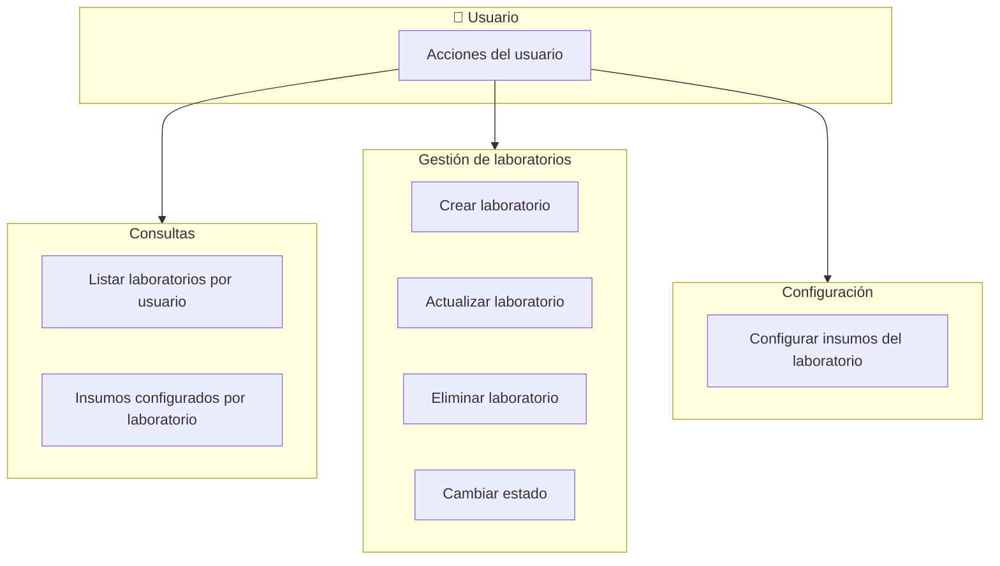

# Flujo del módulo Laboratorio

## Mapa de procesos de negocio

---

## Flujo paso a paso

---

## 1. Listar laboratorios (por rol y laboratorios asignados)

1. **Frontend – laboratorioService.getAll**  
   Llama GET `/laboratorios`.

2. **Backend – laboratorioRoutes**  
   Ruta GET `/`. Middlewares: authenticateToken, authorize('read', 'Laboratorio').

3. **Backend – laboratorioController.getLaboratorios**  
   Llama laboratorioService.getAllByUser(rol, laboratorio_ids).

4. **Backend – laboratorioService.getAllByUser**  
   Delega en Laboratorio.getAllByUser(user_rol, user_laboratorio_ids).

5. **Backend – Laboratorio.getAllByUser**  
   Consulta laboratorios aplicando rol (Jefe de Laboratorio filtra por laboratorio_ids). Devuelve lista.

6. **Backend – laboratorioController.getLaboratorios**  
   Responde 200 con `{ success, data: laboratorios }`.

---

## 2. Crear laboratorio

1. **Frontend – laboratorioService.create**  
   Envía POST `/laboratorios` con body (codigo, nombre, ubicacion, escuela_id, piso, estado).

2. **Backend – laboratorioRoutes**  
   Ruta POST `/`. Middlewares: authenticateToken, authorize('create', 'Laboratorio'), validate(createLaboratorioSchema).

3. **Backend – laboratorioController.createLaboratorio**  
   Extrae body y llama laboratorioService.create(codigo, nombre, ubicacion, escuela_id, piso, estado).

4. **Backend – laboratorioService.create**  
   Llama Laboratorio.create(...). El modelo valida que Escuela.exists(escuela_id); si no existe lanza AppError 400. Inserta en laboratorios y devuelve insertId.

5. **Backend – laboratorioController.createLaboratorio**  
   Responde 201 con `{ success, data: { id, codigo, nombre, ... }, message }`.

---

## 3. Actualizar laboratorio

1. **Frontend – laboratorioService.update**  
   Envía PUT `/laboratorios/:id` con body (campos editables).

2. **Backend – laboratorioRoutes**  
   Ruta PUT `/:id`. Middlewares: authenticateToken, authorize('update', 'Laboratorio'), validate(updateLaboratorioSchema).

3. **Backend – laboratorioController.updateLaboratorio**  
   Toma id de params y body; llama laboratorioService.update(laboratorioId, body).

4. **Backend – laboratorioService.update**  
   Laboratorio.getLaboratorioById(laboratorioId); si no existe lanza AppError 404. Fusiona body con datos actuales. Laboratorio.update(id, codigo, nombre, ubicacion, escuela_id, piso, estado). El modelo valida Escuela.exists(escuela_id) si se envía. Devuelve objeto con datos actualizados.

5. **Backend – laboratorioController.updateLaboratorio**  
   Responde 200 con `{ success, data, message }`.

---

## 4. Eliminar laboratorio

1. **Frontend – laboratorioService.delete**  
   Envía DELETE `/laboratorios/:id`.

2. **Backend – laboratorioRoutes**  
   Ruta DELETE `/:id`. Middlewares: authenticateToken, authorize('update', 'Laboratorio'), validate(deleteLaboratorioSchema).

3. **Backend – laboratorioController.deleteLaboratorio**  
   Toma id de params y llama laboratorioService.delete(laboratorioId).

4. **Backend – laboratorioService.delete**  
   Llama Laboratorio.delete(id). El modelo: getLaboratorioById(id) → 404 si no existe; checkRelations(id) → lanza AppError 409 si tiene equipos, reservas, inventario_insumos o incidencias; DELETE FROM laboratorios WHERE id = ?.

5. **Backend – laboratorioController.deleteLaboratorio**  
   Responde 200 con `{ success, message }`.

---

## 5. Cambiar estado del laboratorio

1. **Frontend – laboratorioService.changeEstado**  
   Envía PATCH `/laboratorios/:id/estado` con body { estado }.

2. **Backend – laboratorioRoutes**  
   Ruta PATCH `/:id/estado`. Middlewares: authenticateToken, authorize('update', 'Laboratorio'), validate(changeEstadoLaboratorioSchema).

3. **Backend – laboratorioController.changeEstadoLaboratorio**  
   Toma id y estado; llama laboratorioService.changeEstado(laboratorioId, estado).

4. **Backend – laboratorioService.changeEstado**  
   Laboratorio.exists(laboratorioId); si no existe lanza AppError 404. Laboratorio.updateEstado(laboratorioId, estado). Devuelve { id, estado }.

5. **Backend – laboratorioController.changeEstadoLaboratorio**  
   Responde 200 con `{ success, data: { id, estado_anterior, estado_nuevo }, message }`.

---

## 6. Obtener insumos configurados de un laboratorio

1. **Frontend – laboratorioService.getInsumos**  
   Llama GET `/laboratorios/:id/insumos`.

2. **Backend – laboratorioRoutes**  
   Ruta GET `/:id/insumos`. Middlewares: authenticateToken, authorize('read', 'Laboratorio'), validate(getInsumosLaboratorioSchema).

3. **Backend – laboratorioController.getInsumosLaboratorio**  
   Toma id de params y llama laboratorioService.getInsumos(laboratorioId).

4. **Backend – laboratorioService.getInsumos**  
   Laboratorio.exists(laboratorioId); si no existe lanza AppError 404. Laboratorio.getInsumosByLaboratorio(laboratorio_id). Devuelve lista de insumos.

5. **Backend – laboratorioController.getInsumosLaboratorio**  
   Responde 200 con `{ success, data: insumos }`.

---

## 7. Configurar insumos del laboratorio

1. **Frontend – laboratorioService.configurarInsumos**  
   Envía PUT `/laboratorios/:id/insumos` con body { insumo_ids }.

2. **Backend – laboratorioRoutes**  
   Ruta PUT `/:id/insumos`. Middlewares: authenticateToken, authorize('update', 'Laboratorio'), validate(configurarInsumosLaboratorioSchema).

3. **Backend – laboratorioController.configurarInsumosLaboratorio**  
   Toma id y insumo_ids; llama laboratorioService.configurarInsumos(laboratorioId, insumo_ids).

4. **Backend – laboratorioService.configurarInsumos**  
   Laboratorio.exists(laboratorio_id); si no existe lanza AppError 404. Obtiene conexión, beginTransaction, Laboratorio.configurarInsumos(laboratorio_id, insumo_ids, connection) (DELETE inventario_insumos por laboratorio_id, INSERT insumo_ids), commit; en catch rollback y throw error; finally release.

5. **Backend – Laboratorio.configurarInsumos**  
   Usa la conexión recibida: DELETE FROM inventario_insumos WHERE laboratorio_id = ?; INSERT insumos configurados. No inicia transacciones.

6. **Backend – laboratorioController.configurarInsumosLaboratorio**  
   Responde 200 con `{ success, message, data: { laboratorio_id, insumos_configurados } }`.

---

## Nomenclatura y patrón

- **Módulo complejo**: Controller → **Service** → Model. El controller no llama al modelo directamente; delega en laboratorioService.
- **Transacciones**: Solo **configurarInsumos** usa transacción en el service (getConnection, beginTransaction, modelo recibe connection, commit/rollback, release). El resto de operaciones usan pool vía modelo (una o varias sentencias sin transacción explícita en el service).
- **Errores**: El modelo usa handleDBError y AppError; el service lanza AppError para reglas de negocio (no encontrado, relaciones). El controller solo hace next(error).
